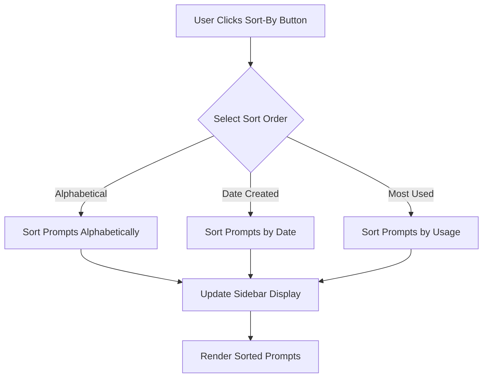

# Sort-By Button Architecture

This document outlines the architecture for implementing a sort-by button to organize prompts in the sidebar.

## Workflow



## Implementation Details

### 1. **`index.html`**

- **Objective:** Add a sort-by button and a dropdown menu to the sidebar.
- **Changes:**
  - Add a `div` container for the sort-by button and dropdown.
  - Include options for sorting alphabetically, by date, and by usage.

### 2. **`app.js`**

- **Objective:** Implement the sorting logic to handle different sort orders.
- **Changes:**
  - Add an event listener to the sort-by button to toggle the dropdown.
  - Implement a `sortPrompts` function to reorder the prompts based on the selected option.
  - Modify the `displayPrompts` function to render the sorted prompts.

### 3. **`style.css`**

- **Objective:** Style the new elements for a consistent look and feel.
- **Changes:**
  - Add styles for the sort-by button, dropdown menu, and active sort option.
  - Ensure the new elements are responsive and accessible.

## Code Snippets

### `index.html`

```html
<div class="sidebar-controls">
  <button id="sort-by-btn">Sort By</button>
  <div id="sort-by-dropdown" class="dropdown-content">
    <a href="#" data-sort="alphabetical">Alphabetical</a>
    <a href="#" data-sort="date">Date Created</a>
    <a href="#" data-sort="usage">Most Used</a>
  </div>
</div>
```

### `app.js`

```javascript
const sortByBtn = document.getElementById('sort-by-btn');
const sortByDropdown = document.getElementById('sort-by-dropdown');

sortByBtn.addEventListener('click', () => {
  sortByDropdown.classList.toggle('show');
});

const sortPrompts = (sortOrder) => {
  // Implementation details to be added
};
```

### `style.css`

```css
.sidebar-controls {
  position: relative;
  display: inline-block;
}

.dropdown-content {
  display: none;
  position: absolute;
  background-color: #f9f9f9;
  min-width: 160px;
  box-shadow: 0px 8px 16px 0px rgba(0,0,0,0.2);
  z-index: 1;
}